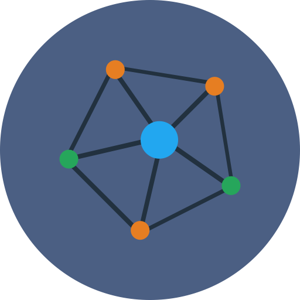

Loading...

### Cisabz'17 {style="color:white"}

[Show Menu](#nav-wrap "Show navigation") [Hide
Menu](# "Hide navigation")

-   [Home.](#hero)
-   [Events.](#portfolio)
-   [About.](#about)
-   [Contact.](#contact)
-   [Register.](https://goo.gl/forms/IfGPKvtb7Lm8WWg92)

-   Cisabz '17 \
     A National Level Technical Symposium on \
     1st September, 2017
    ==========================================

    [More About Us](#about)

-   Cisabz '17 \
     A Platform to Show your Talents
    ================================

    [See Our Events](#portfolio)

-   Hey Folks!\
     Its time to Register
    =====================

    [Register](#about)

Events.
=======

* * * * *

Cisabz provides a platform for students to showcase their technical
skills and creativity.

##### Prezentazy

Paper Presentation

##### Bug Hunting

Debugging

##### conexão

Connexions

##### Ad-Mad

Advertisement

##### Kviz

Online Quiz

##### fotographia

Photography

##### Talentia

Remove the Bug in your Heart

##### Fun 'O' Mania

Fun Events

Who Are We.
===========

* * * * *

Kings College of Engineering (KCE) is an institution which was formed
with the single aim of providing quality education to the poor and
under-privileged students of this region KCE has been started during
2001 and run by Raj Educational Trust (RET). KCE is approved by All
India Council of Technical Education, NewDelhi (AICTE) and is affiliated
to the Anna University, Chennai. KCE has acquired ISO certification by
TUV, Rheinland, Germany and Accredeited by NBA, AICTE - India.

### Vision.

To impart globally competitive technical education, enhance human values
and to provide a research atmosphere to the socially challenged
aspirants.

### Mission.

Providing a comprehensive theoretical foundation, inculcating state of
the art engineering practices and cutting edge research ambience that
leads to societal upliftment with ethical values through effective
teaching - learning methodologies and appropriate information
communication tools via dedicated faculty to the aspirants.

### Quality Policy

We are committed to provide top quality education at the prescribed
costs and impart ethical values to the students of this region using
modern and innovative teaching methods combined with experienced
faculties. We shall truly strive to make the students socially
responsible and contribute to the rapid growth of our country.

### Our Motto – Seek, Strive, Succeed.

The Motto of KCE, follows the path shown by our great kings in
continuing our tradition of engineering excellence KCE with its high
aims, planned approach, highly skilled staff and state of the art
infrastructure is the hub for students with goals set to shape up their
careers.

Cisabz'17.
==========

* * * * *

CISABZ, an Annually Recurring National Level Technical Symposium
Conducted by the Department of Computer Science and Engineering, Kings
College of Engineering, Punalkulam. It is the 17th Annual technical fest
of CSE Department that hosts a variety of exciting events

Why?
====

Engineering has a vast scope in the field of research. These researches
have a potential to cause a revolution in the future in terms of
technology and information. The CSE Department Symposium (CISABZ’17)
aims to provide an opportunity to all the aspiring CSE Engineering
students who are inclined towards discovering, learning and innovating
to present their skills. If you are a research enthusiast and you feel
that your paper has got something extraordinary, Symposium is a platform
to showcase your talents.

Register Online

[Register](https://docs.google.com/forms/d/e/1FAIpQLSdSxF6oIhWfVQZfx8ZX9Y9IfZpgfMmko4TiVh18d1dWTuTBbw/viewform)

Get In Touch With Us.
=====================

* * * * *

Feel free to ping us!

First Name \*

Last Name \*

Email \*

Subject

Message \*

Send Message

**Your message was sent, thank you!\

### [ABOUT MOZILLA KINGS](https://mozillatn.github.io/KingsCampusClub)

Mozilla Kings is a Campus club Contributing under [Mozilla
Tamilnadu](https://mozillatn.github.io) for the Open source project of
Mozilla Firefox. We are the contributers of Quality Assurance team from
India and Localizing the mozilla products to our Tamil language.

We Mozilla Kings is one of the Top Clubs in India to the Contributing
towards Quality Assurance for Firefox products.

### Contact Us {.address}

Kings College of Engineering\
 Punalkulam, Thanjavur-613 303\
 Tamilnadu\

-   [9698611282](tel:9698611282)
-   [cisabz2k17@gmail.com](mailto:cisabz2k17@gmail.com)

### Follow Us {.contact}

-   [Facebook](https://www.facebook.com/cisabz17/)
-   [Twitter](#)
-   [GooglePlus](https://plus.google.com/u/0/113447091354715830689)

© Copyright 2017 Cisabz. Design by [Kings
Mozillians.](http://mozillatn.github.io/KingsCampusClub)

[Top**](#hero "Back to Top")
